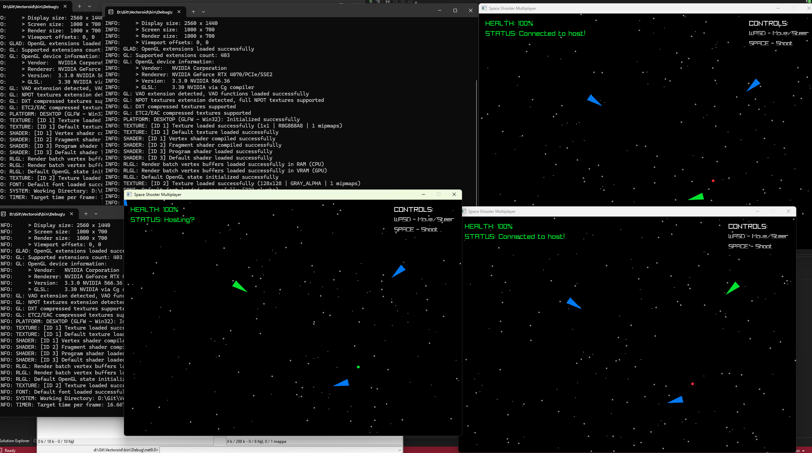
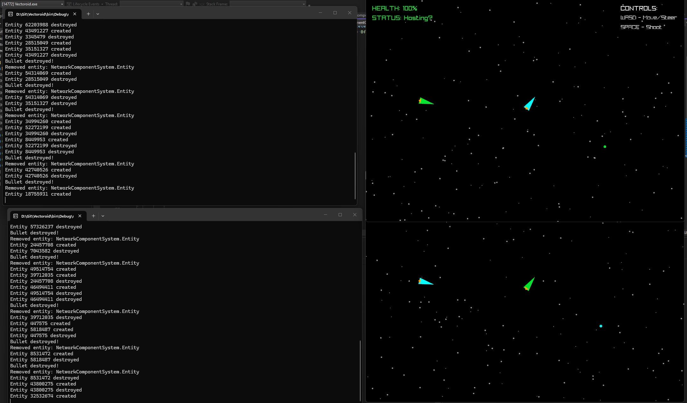

# 🎮 NetworkComponentSystem - Authoritative Multiplayer Framework

> A robust, server-authoritative networking component system for real-time multiplayer games. Built with [Raylib](https://www.raylib.com/), supporting multiple entity types, physics synchronization, and seamless client-server architecture.

---

## 📋 Table of Contents

- [Features](#-features)
- [Project Structure](#-project-structure)
- [Installation](#-installation)
- [How It Works](#-how-it-works)
- [Component System](#-component-system)
- [Network Protocol](#-network-protocol)
- [Usage Examples](#-usage-examples)
- [Screenshots](#-screenshots)
- [Contributing](#-contributing)
- [License](#-license)

---

## ✨ Features

- **🛡️ Server-Authoritative Architecture** - Full trust server model preventing cheating
- **🔌 Component-Based Architecture** - Modular entity system with bitmask component flags
- **📦 Efficient Network Synchronization** - Dirty-flag based packet compression
- **🎮 Multi-Entity Support** - Ships, bullets, health, movement, draw components
- **🌐 Client-Server Architecture** - Seamless ghost object implementation
- **📊 Transform Synchronization** - Position/rotation scaling support
- **⚡ Damage System** - Built-in health with damage over time support

---

## 📂 Project Structure

```
NetworkComponentSystem/
├── NetworkComponentSystem/
│   ├── Component.cs                # Base component class with flags
│   ├── Entity.cs                   # Entity with component caching
│   ├── NetworkEntity.cs            # Network packet handling
│   ├── Transform.cs                # Position/rotation/scale component
│   ├── HealthComponent.cs          # Base health component
│   ├── BulletHealthComponent.cs    # Bullets with DoT
│   ├── MovementComponent.cs        # Velocity/acceleration physics
│   ├── DrawComponent.cs            # Sprite drawing
│   ├── ControllerComponent.cs      # User input handling
│   └── IUpdatable.cs               # Update interface
├── Properties/
├── GameConfig.cs                   # Configuration settings
└── Program.cs                      # Main entry point
```

---

## 🚀 Installation

### Prerequisites

- [Raylib](https://www.raylib.com/) C# bindings
- .NET 6.0 or higher
- C# 11 or higher
- Raylib_cs NuGet package

### Setup Steps

1. **Restore Dependencies**
   ```bash
   dotnet restore
   ```

2. **Install Raylib**
   ```bash
   dotnet add package Raylib_cs
   ```

3. **Build the Project**
   ```bash
   dotnet build
   ```

4. **Run the Game**
   ```bash
   dotnet run
   ```

---

## 🔧 How It Works

### Architecture Overview

```
┌─────────────────────────────────────────────────────────┐
│                    SERVER (HOST)                        │
│  ┌───────────────────────────────────────────────────┐  │
│  │  Runs all physics & game logic                    │  │
│  │  Authoritative source of truth                    │  │
│  │  Sends position data only to clients              │  │
│  └───────────────────────────────────────────────────┘  │
│                              ↓                          │
│                     NETWORK PACKETS                     │
│              (Transform + Health + Draw)                │
│                              ↓                          │
│              ┌──────────────────────────────────────┐   │
│              │           CLIENTS (GHOSTS)           │   │
│              │  - Apply received positions          │   │
│              │  - No local physics                  │   │
│              │  - Interpolate/lerp for smoothness   │   │
│              └──────────────────────────────────────┘   │
└─────────────────────────────────────────────────────────┘
```

### Component Flags

```csharp
[Flags]
public enum ComponentBits
{
    Transform = 1 << 0,        // 00001 - Position/rotation
    Health = 1 << 1,           // 00010 - HP tracking
    Movement = 1 << 2,         // 00100 - Velocity/acceleration
    BulletHealth = 1 << 3,     // 01000 - Bullet damage
    Draw = 1 << 4,             // 10000 - Sprite rendering
    Controller = 1 << 5,       // 100000 - Input handling
}
```

---

## 🎨 Component System

### Available Components

| Component | Description | Authoritative |
|-----------|-------------|---------------|
| **Transform** | Position, rotation, scale | ✅ Server + Client |
| **Health** | Base health tracking | ✅ Server |
| **BulletHealth** | Bullets with damage over time | ✅ Server |
| **Movement** | Velocity, acceleration, friction | ❌ Server only |
| **Draw** | Sprite rendering | ✅ Server + Client |
| **Controller** | User input handling | ❌ Client only |

---

## 📡 Network Protocol

### Packet Format

```
┌───────────┬──────────────┬─────────────────┬────────────────┬───────┐
│Byte[0]    │Byte[1-4]     │Byte[5-8]        │Byte[9]         │Bytes  │
│-----------│--------------│-----------------│----------------│-------│
│MessageType│PlayerId      │EntityId (Guid)  │ComponentMask   │Payload│
└───────────┴──────────────┴─────────────────┴────────────────┴───────┘
```

**Message Types:**

| Type       | Value | Description                        |
|------------|-------|------------------------------------|
| **Add**    |   0   | Add new entity with all components |
| **Create** |   1   | Destroy entity                     |
| **Update** |   2   | Update dirty components            |

---

## 🧪 Usage Examples

### Creating an Entity

```csharp
public Entity CreatePlayerEntity()
{
    var entity = new Entity();
    
    entity.AddComponent(new Transform())
        .AddComponent(new HealthComponent(100))
        .AddComponent(new MovementComponent(Vector2.Zero, 200f))
        .AddComponent(new DrawComponent(0, Color.Red));
    
    return entity;
}
```

### Server-Side Entity Update

```csharp
public void UpdateNetworkEntities()
{
    // Process all network entities
    foreach (var ne in networkEntities.Values)
    {
        if (ne.Local != null)
        {
            ne.Local.Update();
            
            // Send updates if any components are dirty
            var packet = NetworkEntity.EncodeEntity(ne);
            SendPacket(packet);
        }
    }
}
```

### Client-Side Ghost Entity

```csharp
public void ReceiveEntityUpdate(byte[] data)
{
    // Decode incoming packet
    NetworkEntity.ProcessEntity(data, networkEntities);
    
    // Only render what server sends
    // No local physics execution
}
```

---

## 🖼️ Screenshots

### Gameplay Overview



> *Screenshot showing multiplayer gameplay with multiple ships and bullets*

### Multiplayer Interaction



> *Screenshot showing server-authoritative synchronization in action*

---


## 🤝 Contributing

We welcome contributions! Please follow these guidelines:

1. **Fork the repository**
2. **Create a feature branch** (`git checkout -b feature/AmazingFeature`)
3. **Commit your changes** (`git commit -m 'Add some AmazingFeature'`)
4. **Push to the branch** (`git push origin feature/AmazingFeature`)
5. **Open a Pull Request**

### Code Style

- Follow C# naming conventions (PascalCase for classes, camelCase for fields)
- Use `[Flags]` enum for component bits
- Keep Update methods stateless when possible
- Mark components as dirty before network transmission

---

## 📄 License

This project is licensed under the MIT License - see the [LICENSE](LICENSE) file for details.

```
MIT License

Permission is hereby granted, free of charge, to any person obtaining a copy
of this software and associated documentation files (the "Software"), to deal
in the Software without restriction, including without limitation the rights
to use, copy, modify, merge, publish, distribute, sublicense, and/or sell
copies of the Software, and to permit persons to whom the Software is
furnished to do so, subject to the following conditions:

The above copyright notice and this permission notice shall be included in all
copies or substantial portions of the Software.
```

---

## 📦 Dependencies

```
┌─────────────────────────────────────┐
│   .NET 6.0+                         │
│   Raylib_cs NuGet Package           │
│   System.Numerics                   │
└─────────────────────────────────────┘
```

---

## 🙏 Acknowledgments

- [Raylib](https://www.raylib.com/) - For the amazing game development framework
- The community - For all the helpful contributions

---

**⭐ Star this project if you find it useful!**